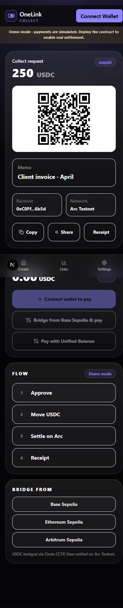
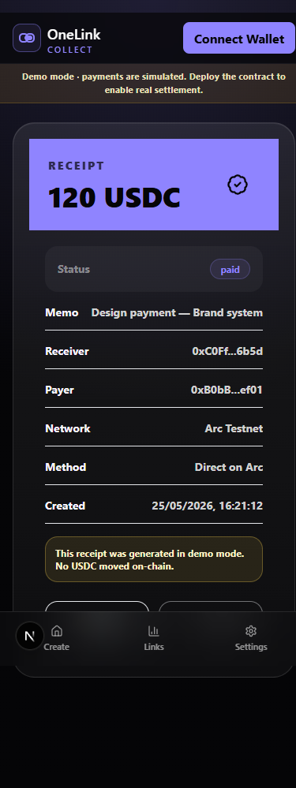
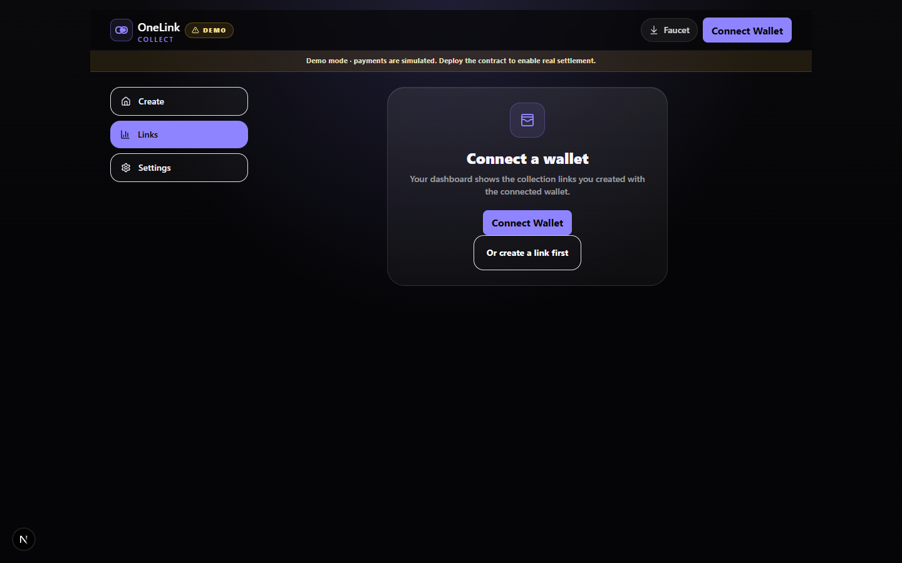
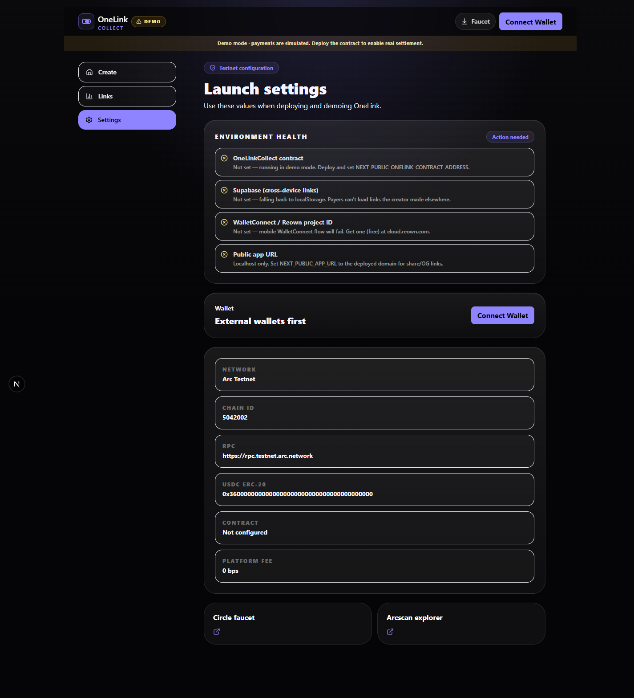
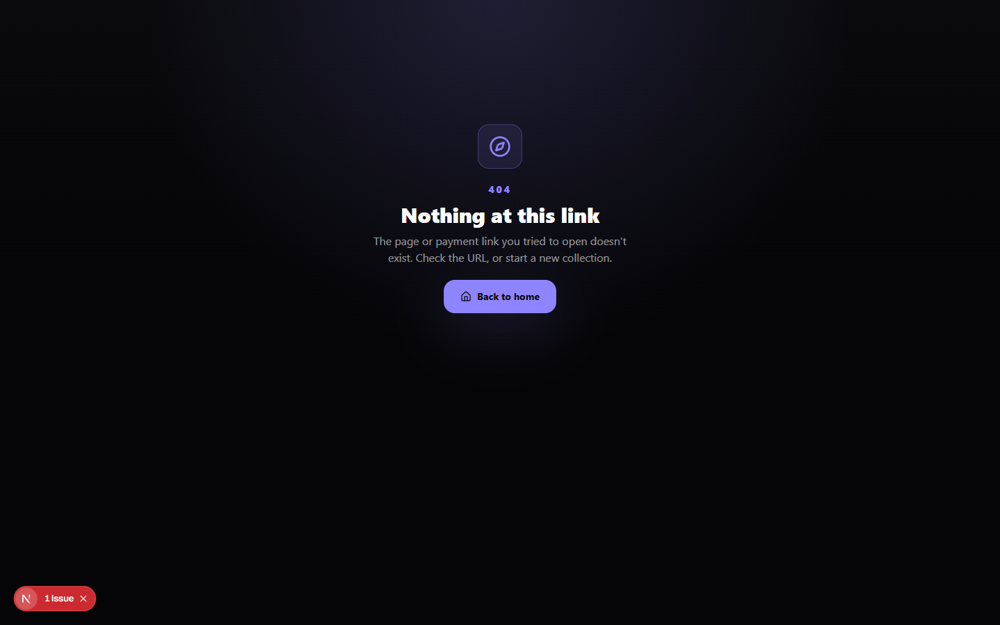

<div align="center">

# OneLink Collect

**One link. Any USDC. Instantly on Arc.**

Mobile-first USDC payment links that settle on **Arc Testnet** and bridge in from any chain through **Circle App Kit**.

[**Open the live demo →**](https://onelink-mauve-nu.vercel.app)

<br />


</div>

---

## What it does

OneLink turns a request like *"send me 250 USDC for the April invoice"* into a single shareable URL. The recipient pastes it in iMessage, Slack, or a tweet, and the payer can settle in three ways:

- **Pay directly on Arc** — wallet already on Arc Testnet, one approve + one `payLink` call.
- **Bridge & pay** — wallet on Base / Ethereum / Arbitrum Sepolia; Circle CCTP moves USDC to Arc and then settles.
- **Unified Balance** — Circle Gateway spends from a unified USDC balance across chains in under 500 ms.

Every settlement emits an on-chain receipt with a verifiable Arcscan transaction hash. Creators get a dashboard with status, copy/share/QR code, and the ability to cancel a link before it's paid.

---

## Product surface

### Create a link

Mobile-first form with checksum validation, sane amount caps, and clear inline guidance.


### Pay a link

A QR code for cross-device sharing, an Arc USDC balance preflight ("need X more USDC on Arc"), and three settlement paths.

<table>
  <tr>
    <td align="center" width="50%">
      
      <br />
      <sub><b>Desktop</b></sub>
    </td>
    <td align="center" width="50%">
      
      <br />
      <sub><b>Mobile</b></sub>
    </td>
  </tr>
</table>

### Receipt

Sealed, shareable proof of payment. Demo settlements are visually marked and never link out to Arcscan.

<table>
  <tr>
    <td align="center" width="50%">
      
      <br />
      <sub><b>Desktop</b></sub>
    </td>
    <td align="center" width="50%">
      
      <br />
      <sub><b>Mobile</b></sub>
    </td>
  </tr>
</table>

### Dashboard

Connect-wallet empty state, per-link copy / open / cancel actions, and roll-up of total collected.



### Settings

Environment health panel — at-a-glance check on whether the contract, Supabase, WalletConnect, and public URL are wired up, with friendly actions for anything missing.



### 404

Branded not-found instead of the Next.js default.



---

## Stack

|  |  |
| --- | --- |
| **Framework** | Next.js 15 (App Router) · React 19 · TypeScript · Tailwind CSS |
| **Wallet** | wagmi · viem · RainbowKit |
| **Bridging** | `@circle-fin/app-kit` · `@circle-fin/adapter-viem-v2` |
| **Network** | Arc Testnet (chain id `5042002`) · USDC as native gas |
| **Contract** | Solidity 0.8.28 · Foundry · 24 tests incl. 256-run fuzz |
| **Storage** | Supabase (optional) with `localStorage` fallback |
| **CI** | GitHub Actions — lint · typecheck · build · forge test |
| **Hosting** | Vercel · security headers · OG image + favicon at edge |

---

## Quick start (local)

```bash
git clone https://github.com/Pratiikpy/onelink.git
cd onelink
npm install
cp .env.example .env.local
npm run dev
```

Open `http://localhost:3000`. The app boots in **demo mode** — links live in `localStorage`, payments emit a `0xDEM0…` synthetic tx hash, and the header is amber-banded to make this visually unmistakable.

### Verification suite

```bash
npm run lint        # ESLint
npm run typecheck   # tsc --noEmit
npm run build       # Next.js production build
forge test          # 24 Solidity tests (needs Foundry)
```

---

## Launch checklist

The full local repo is launch-ready — the remaining work is configuration only. About 30 minutes end-to-end.

### 1 · WalletConnect / Reown project ID (2 min)

Without this the mobile QR connect flow silently fails. Sign in at <https://cloud.reown.com>, create a project, copy the project ID.

```bash
NEXT_PUBLIC_WALLETCONNECT_PROJECT_ID=...
```

### 2 · Deploy `OneLinkCollect.sol` to Arc Testnet (10 min)

Arc uses USDC as native gas. Fund the deployer at <https://faucet.circle.com>.

```bash
ARC_TESTNET_RPC_URL=https://rpc.testnet.arc.network
DEPLOYER_PRIVATE_KEY=0x...
FEE_RECIPIENT=0x...          # optional, defaults to deployer
PLATFORM_FEE_BPS=0           # 50 = 0.5 %, hard-capped at 100 (1 %)

forge script contracts/script/DeployOneLinkCollect.s.sol:DeployOneLinkCollect \
  --rpc-url arc_testnet \
  --broadcast
```

Set the returned address:

```bash
NEXT_PUBLIC_ONELINK_CONTRACT_ADDRESS=0x...
```

### 3 · Provision Supabase (5 min)

Without Supabase, a payer cannot load a link the creator made on another device.

1. Create a project at <https://supabase.com>.
2. SQL Editor → paste `supabase/schema.sql` → Run.
3. Project Settings → API → copy the URL and the **anon** key.

```bash
NEXT_PUBLIC_SUPABASE_URL=https://xxx.supabase.co
NEXT_PUBLIC_SUPABASE_ANON_KEY=ey...
```

### 4 · Deploy to Vercel (5 min)

```bash
npm i -g vercel
vercel link
vercel env pull .env.local        # mirror env from Vercel into local
vercel deploy --prod
```

Set the same `NEXT_PUBLIC_*` envs in *Project Settings → Environment Variables*.

> The current preview is deployed at **<https://onelink-mauve-nu.vercel.app>** with `NEXT_PUBLIC_ALLOW_DEMO=true` (demo mode, no contract). Add the four envs above and redeploy to switch into real settlement mode.

### 5 · Smoke test

Open the production URL in wallet A, create a link. Open the link in wallet B (different browser). Pay. Confirm the tx on [Arcscan](https://testnet.arcscan.app). Open the receipt back in wallet A's dashboard.

---

## Production safety

A `NODE_ENV=production` build refuses to render in the browser if `NEXT_PUBLIC_ONELINK_CONTRACT_ADDRESS` is missing. This prevents a misconfigured deploy from silently emitting demo "receipts" that don't move USDC.

Override only when demo mode in prod is intentional (a hackathon or marketing preview):

```bash
NEXT_PUBLIC_ALLOW_DEMO=true
```

The header banner makes demo mode visually unmistakable either way.

---

## Architecture

```
app/
  page.tsx                 ·  Create
  pay/[slug]/page.tsx      ·  Pay
  receipt/[id]/page.tsx    ·  Receipt
  dashboard/page.tsx       ·  Creator dashboard
  settings/page.tsx        ·  Environment health
  layout.tsx               ·  Global metadata · OG · Twitter cards · PWA viewport
  error.tsx                ·  Global error boundary
  not-found.tsx            ·  Branded 404
  icon.tsx                 ·  Dynamic PNG favicon
  apple-icon.tsx           ·  Dynamic 180×180 PWA touch icon
  opengraph-image.tsx      ·  Dynamic 1200×630 social card
  robots.ts · sitemap.ts   ·  SEO basics — pay/receipt URLs blocked
components/                ·  Client UI
lib/
  arc.ts                   ·  Network constants · explorerTx · isDemoTxHash
  contracts.ts             ·  ABI + production-safety throw
  payments.ts              ·  Slug / status types / label helpers
  share.ts                 ·  useCopy hook + Web Share API
  storage.ts               ·  Supabase + localStorage abstraction
contracts/                 ·  Foundry project (24 tests, 256-run fuzz)
supabase/schema.sql        ·  Table + RLS + immutability trigger
.github/workflows/ci.yml   ·  Lint · typecheck · build · forge test
```

### Security trade-offs

The Supabase RLS policies are intentionally permissive for anon-key browser writes (no auth in v1). To stop link tampering without a full auth layer:

- A `BEFORE UPDATE` trigger seals immutable columns (`creator_wallet`, `recipient_wallet`, `amount_usdc`, `memo`, `contract_link_id`, `created_at`).
- Paid and cancelled rows are sealed entirely — even the status can't be flipped after the fact.
- Inserts are constrained to `status = 'unpaid'`.

A determined attacker can still mark an unpaid link as "paid" with a fake tx hash; receivers should verify on-chain on Arcscan for any high-value flow. Hardening paths:

1. Move writes to Next.js Route Handlers with `SUPABASE_SERVICE_ROLE_KEY`.
2. Add Supabase Auth and scope policies to `auth.uid()`.
3. Have the server cross-check `link.tx_hash` against an Arc RPC before trusting `status = 'paid'`.

### Smart contract surface

```solidity
function createLink(bytes32 linkId, address recipient, uint256 amount, uint64 expiresAt) external;
function payLink(bytes32 linkId) external;          // approve USDC first
function cancelLink(bytes32 linkId) external;       // creator-only, unpaid-only
function getLink(bytes32 linkId) external view returns (PaymentLink memory);

event PaymentLinkCreated(bytes32 indexed linkId, address indexed creator, address indexed recipient, uint256 amount, uint64 expiresAt);
event PaymentCompleted(bytes32 indexed linkId, address indexed payer, address indexed recipient, uint256 grossAmount, uint256 feeAmount);
event PaymentLinkCancelled(bytes32 indexed linkId, address indexed creator);
```

Platform fee is capped at `100 bps` (1 %) in the constructor and `setFeeConfig`. Ownership is transferable. There is no `selfdestruct`, no proxy, no upgrade path — deploy once, immutable forever.

---

## Network reference

| | |
| --- | --- |
| Chain | Arc Testnet |
| Chain ID | `5042002` |
| RPC | `https://rpc.testnet.arc.network` |
| Explorer | [`testnet.arcscan.app`](https://testnet.arcscan.app) |
| USDC ERC-20 | `0x3600000000000000000000000000000000000000` |
| Faucet | [`faucet.circle.com`](https://faucet.circle.com) |
| Native gas | USDC (yes, really) |

---

## Don't commit

`.env.local` · `DEPLOYER_PRIVATE_KEY` · `SUPABASE_SERVICE_ROLE_KEY` · `contracts/broadcast/` · `contracts/cache/` · `contracts/out/`

---

## License

[MIT](./LICENSE) © 2025 OneLink Collect contributors.
