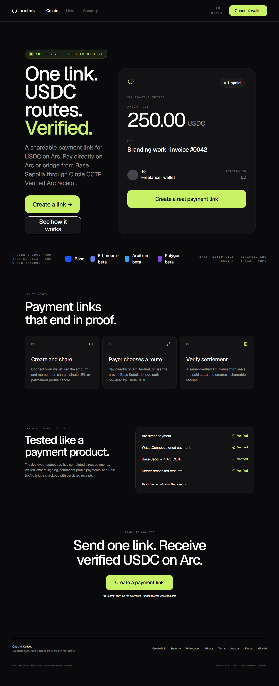
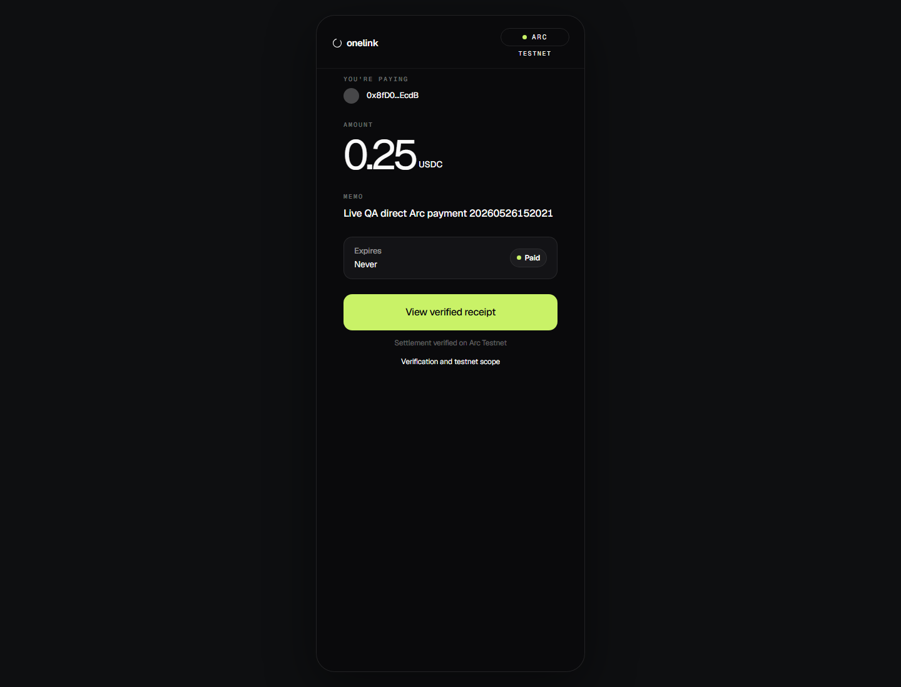
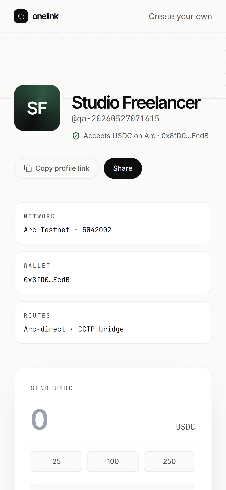
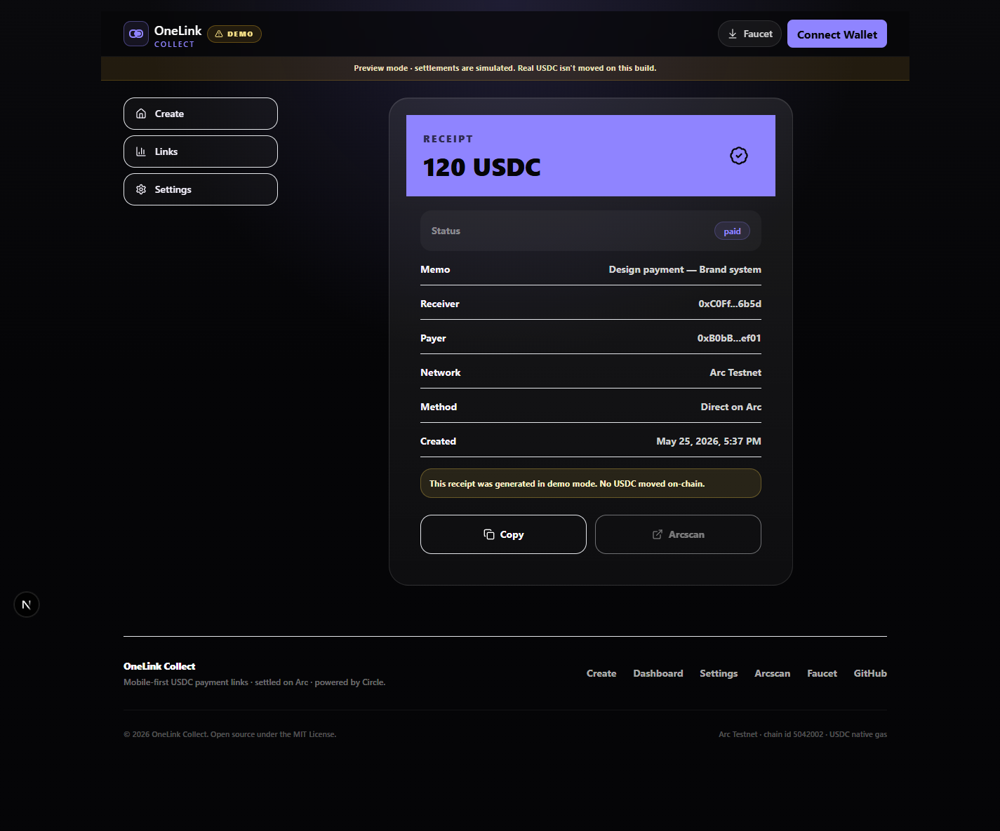

<div align="center">

# OneLink Collect

**One link. Supported USDC routes. Verified on Arc.**

A premium testnet payment-link product for freelancers: create one shareable link, let the payer use a supported USDC route, and finish with a server-verified Arc receipt.

[](https://github.com/Pratiikpy/onelink/actions/workflows/ci.yml)
[](./LICENSE)
[](https://testnet.arcscan.app)
[](https://developers.circle.com/cctp)

[**Open live app**](https://onelink-mauve-nu.vercel.app) · [**Pitch deck**](https://onelink-mauve-nu.vercel.app/pitch) · [**Read whitepaper**](https://onelink-mauve-nu.vercel.app/whitepaper) · [**Launch readiness**](./docs/LAUNCH_READINESS.md)

<br />



</div>

---

> [!IMPORTANT]
> **Testnet only.** Final `paid` and `cancelled` states are written by the server **after** the matching Arc Testnet event is verified on-chain. Mainnet, fiat/cards, Solana, and Circle Gateway checkout are intentionally out of the launch scope.

---

## Contents

- [What it does](#what-it-does) · 30-second tour
- [Why OneLink](#why-onelink)
- [Built on Arc + Circle](#built-on-arc--circle)
- [Verified scope](#verified-scope) · with live evidence per row
- [Visual walkthrough](#visual-walkthrough)
- [Architecture](#architecture)
- [Product surfaces](#product-surfaces)
- [Local development](#local-development)
- [Verification commands](#verification-commands)
- [Safety boundaries](#safety-boundaries)
- [Docs deep-dive](#docs-deep-dive)

---

## What it does

A 30-second tour of one full payment cycle:

1. **Creator** connects a wallet on `/create`, sets amount, memo, recipient, and optional expiry. The browser signs an Arc transaction; the server **verifies the `PaymentLinkCreated` event** before persisting the invoice.
2. **Payer** opens the shareable link, picks a route — direct USDC on Arc, or bridge from Base Sepolia via Circle CCTP — and signs.
3. **Server** watches Arc for the matching settlement, then writes the final `paid` state. The browser cannot bypass this gate.
4. **Receipt** at `/receipt/[id]` shows the verified Arcscan transaction, the settlement contract, and a server-verified flag — every detail a reviewer needs to inspect.

Try it now → [**onelink-mauve-nu.vercel.app**](https://onelink-mauve-nu.vercel.app)

---

## Why OneLink

Freelancers lose time asking clients which wallet, chain, and address format they use. OneLink turns that into a single payment URL or profile handle. The launch build focuses on a verified testnet scope: Arc direct settlement and a Base Sepolia to Arc bridge route powered by Circle CCTP.

OneLink is not claiming mainnet readiness, fiat/card payments, Solana support, or arbitrary-wallet instant settlement. The product language is intentionally limited to what has been proven live.

---

## Built on Arc + Circle

| Layer | Choice | Why it matters |
| --- | --- | --- |
| Settlement | **[Arc Testnet](https://testnet.arcscan.app)** · chain id `5042002` | USDC is the native gas token. Sub-second deterministic finality. No ETH-for-gas friction. |
| Bridge | **[Circle CCTP](https://developers.circle.com/cctp) via [App Kit](https://docs.arc.network/app-kit)** | Native USDC burn-and-mint between supported testnets and Arc, with retry-safe step events. |
| Receipts | Arcscan transaction + server reconciliation | Every paid receipt links to the exact on-chain settlement. |
| Stack | Next.js 15 · React 19 · TypeScript · Tailwind · shadcn/ui · Radix UI · Inter · wagmi · viem · RainbowKit · WalletConnect · Foundry · Supabase | Standard Web3 stack with a premium component library. |

---

## Verified scope

Every row below maps to a live test report under [`docs/test-results/`](./docs/test-results). If a row is gated or out-of-scope, the README and the UI both say so.

| Area | Status | Evidence |
| --- | --- | --- |
| Arc direct payment | Live-proven on the public Vercel deployment. | [direct report](./docs/test-results/qa-live-direct/REPORT.md) |
| Browser-wallet full flow | Live-proven create, approve, pay, refresh, and receipt flow. | [browser-wallet report](./docs/test-results/qa-live-browser-wallet/REPORT.md) |
| WalletConnect payment | Live-proven QR pairing and signed Arc settlement through the protocol harness. | [WalletConnect report](./docs/test-results/qa-live-walletconnect-payment/REPORT.md) |
| Base Sepolia → Arc bridge | Live-proven through Circle App Kit and CCTP. | [bridge UI report](./docs/test-results/qa-live-bridge-payment-ui/REPORT.md) |
| Permanent profile payment | Live-proven payer-initiated profile request and settlement. | [profile payment report](./docs/test-results/qa-live-profile-payment/REPORT.md) |
| Creator cancellation | Live-proven server-verified cancellation after Arc transaction. | [cancellation report](./docs/test-results/qa-live-cancel/REPORT.md) |
| Failure-state recovery | Live-verified rejected-wallet, expired-link, and cancelled-link UX. | [failure-states report](./docs/test-results/qa-live-failure-states/REPORT.md) |
| Visual / responsive QA | Production screenshots captured at 390, 768, 1366, 1440, and 1920 px. | [visual report](./docs/test-results/qa-live-visual/REPORT.md) |
| Circle Gateway unified balance | **Gated.** Disabled in checkout until a funded deposit, burn, and mint flow is proven end to end. | [local gateway harness](./docs/test-results/qa-local-gateway/REPORT.md) |

For the full evidence bundle (transaction hashes, screenshots, QA matrix), see [**LAUNCH_READINESS.md**](./docs/LAUNCH_READINESS.md).

---

## Visual walkthrough

<table>
  <tr>
    <td width="50%">
      
      <br />
      <sub><b>Landing</b> · route scope, proof positioning, and primary CTA.</sub>
    </td>
    <td width="50%">
      
      <br />
      <sub><b>Checkout</b> · Arc pre-flight, route picker, and live CCTP timeline.</sub>
    </td>
  </tr>
</table>

<p align="center">
  <sub>Mobile, tablet, and deeper screen-by-screen QA live in <a href="./docs/LAUNCH_READINESS.md">launch readiness</a> and the reports under <a href="./docs/test-results/">docs/test-results</a>.</sub>
</p>

<table>
  <tr>
    <td width="50%">
      
      <br />
      <sub><b>Mobile profile</b> · Linktree-style payment page optimized for small screens.</sub>
    </td>
    <td width="50%">
      
      <br />
      <sub><b>Receipt</b> · Arcscan-backed proof drawer with server-verified flag.</sub>
    </td>
  </tr>
</table>

---

## Architecture

```text
Creator wallet
  -> signs Arc invoice creation
  -> server verifies PaymentLinkCreated
  -> Supabase stores public payment metadata

Payer wallet
  -> pays directly on Arc, or bridges Base Sepolia USDC to Arc through Circle CCTP
  -> server verifies settlement
  -> dashboard and receipt update only after verified state
```

Trust boundaries:

- **Browser** can request actions but cannot mark settlement complete.
- **API routes** verify Arc transaction receipts and contract logs before mutating trusted state.
- **Supabase** stores public metadata behind RLS and an immutability trigger that locks terminal states.
- **Arc contract** (`OneLinkCollect.sol`) is the source of truth for registered, paid, and cancelled links.

---

## Product surfaces

| Surface | Purpose |
| --- | --- |
| Payment links | Specific invoice URL with amount, memo, recipient, expiry, and verified on-chain registration. |
| Profile handles | Permanent `/{handle}` page so a payer can enter amount and memo without asking for a new invoice URL. |
| Checkout | Payer reviews recipient, amount, route, expiry, and testnet scope before signing. |
| Receipts | Verified Arc settlement transaction as the source of truth for completed payments. |
| Trust center | `/security` — tested routes, limitations, privacy, wallet safety, and reconciliation rules. |
| Whitepaper | `/whitepaper` — product thesis, architecture, Circle/Arc usage, and launch scope. |

Repo modules:

| Path | What lives there |
| --- | --- |
| [`app/`](./app) | Next.js routes, API handlers, whitepaper, trust pages |
| [`components/`](./components) | Shared product flows (Arc pre-flight, bridge timeline, gateway timeline, proof drawer) plus `onelink/*` brand components and `ui/*` shadcn primitives. |
| [`contracts/`](./contracts) | OneLinkCollect Solidity contract and Foundry tests (27 passing) |
| [`lib/`](./lib) | Arc, Circle, payment, storage, and reconciliation utilities |
| [`scripts/`](./scripts) | Live QA and deployment verification scripts |
| [`supabase/`](./supabase) | Database schema, RLS policies, immutability trigger |
| [`docs/`](./docs) | Launch readiness, UI audit, curated screenshots |

---

## Local development

Prerequisites: Node.js `>=22 <25` (see [`.nvmrc`](./.nvmrc)) and, optionally, [Foundry](https://book.getfoundry.sh) for the Solidity tests.

```bash
git clone https://github.com/Pratiikpy/onelink.git
cd onelink
npm install
cp .env.example .env.local
npm run dev
```

PowerShell equivalent:

```powershell
git clone https://github.com/Pratiikpy/onelink.git
Set-Location onelink
npm install
Copy-Item .env.example .env.local
npm run dev
```

The app runs in **demo mode** when production environment variables are missing — demo receipts are visibly marked and do not claim real settlement. Required production keys are documented in [`.env.example`](./.env.example).

> Keep private keys, service-role keys, and local `.env*` files out of Git.

---

## Verification commands

| Command | What it proves |
| --- | --- |
| `npm run lint` | ESLint clean across the whole app. |
| `npm run typecheck` | `next typegen` + `tsc --noEmit` clean. |
| `npm run build` | Production Next.js build succeeds for every route. |
| `npm run test:contracts` | Forge tests for `OneLinkCollect.sol` (27 passing). |
| `npm run qa:live:visual` | Screenshots every public surface at 390/768/1366/1440/1920 px against the live deployment. Non-destructive. |
| `npm run qa:live:browser-wallet` | Full create → approve → pay → refresh → receipt cycle on the live deployment. Spends testnet USDC. |
| `npm run qa:live:walletconnect-payment` | WalletConnect QR pairing and signed Arc payment. Spends testnet USDC. |
| `npm run qa:live:bridge-payment-ui` | Base Sepolia → Arc CCTP bridge end-to-end. Spends testnet USDC + Base ETH. |
| `npm run qa:live:profile-payment` | Permanent profile payment cycle. Spends testnet USDC. |
| `npm run qa:live:cancel` | Verified creator cancellation after Arc transaction. Spends Arc gas. |

Raw automation artifacts are intentionally not part of the public README. Public proof is summarized in launch readiness and curated screenshots.

---

## Safety boundaries

- Testnet only: do not send mainnet funds.
- Server routes, not the browser, write final `paid` and `cancelled` states.
- Gateway unified-balance checkout remains disabled until separately proven end to end.
- Solana and fiat/card rails are outside the current launch scope.
- Secrets must stay in environment variables or managed deployment settings.

---

## Docs deep-dive

| File | Why it matters |
| --- | --- |
| [`docs/LAUNCH_READINESS.md`](./docs/LAUNCH_READINESS.md) | Live deployment evidence, transaction hashes, screenshots, QA matrix. |
| [`docs/ARCHITECTURE.md`](./docs/ARCHITECTURE.md) | System design, settlement model, trust boundaries, and current product limits. |
| [`docs/UI_UX_AUDIT.md`](./docs/UI_UX_AUDIT.md) | Final visual audit, responsive checks, and remaining non-UI product limits. |
| [`docs/PRD.md`](./docs/PRD.md) | Product requirements and end-to-end behavior definition. |
| [`docs/PRODUCT_INFO.md`](./docs/PRODUCT_INFO.md) | Every product fact in one place: features, flows, mechanics, scope, technology, verification, limits. |
| [`docs/BEST_POSSIBLE_ONELINK.md`](./docs/BEST_POSSIBLE_ONELINK.md) | Master vision — what the best possible OneLink looks like across Arc, Circle, product, UI, responsiveness, and roadmap. |
| [`docs/AI_BUILD_PROCESS.md`](./docs/AI_BUILD_PROCESS.md) | How Codex, MCP tools, local skills, and evidence-first QA were used. |
| [`docs/pitch/PITCH_DECK_BRIEF.md`](./docs/pitch/PITCH_DECK_BRIEF.md) | Pitch deck narrative, copy, and design direction. |
| [`docs/SECURITY_REVIEW.md`](./docs/SECURITY_REVIEW.md) | Dependency alert disposition and enabled GitHub security controls. |
| [`SECURITY.md`](./SECURITY.md) | Private vulnerability-reporting policy. |
| [`SUPPORT.md`](./SUPPORT.md) | Support boundaries, public issue guidance, and security-report routing. |
| [`supabase/schema.sql`](./supabase/schema.sql) | Database schema, RLS policies, and immutability trigger. |
| [`contracts/src/OneLinkCollect.sol`](./contracts/src/OneLinkCollect.sol) | Arc Testnet settlement contract. |

---

## License

MIT. See [LICENSE](./LICENSE).
