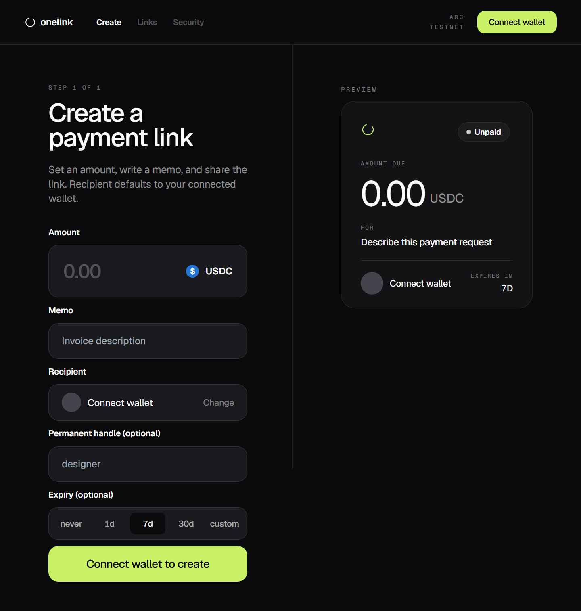
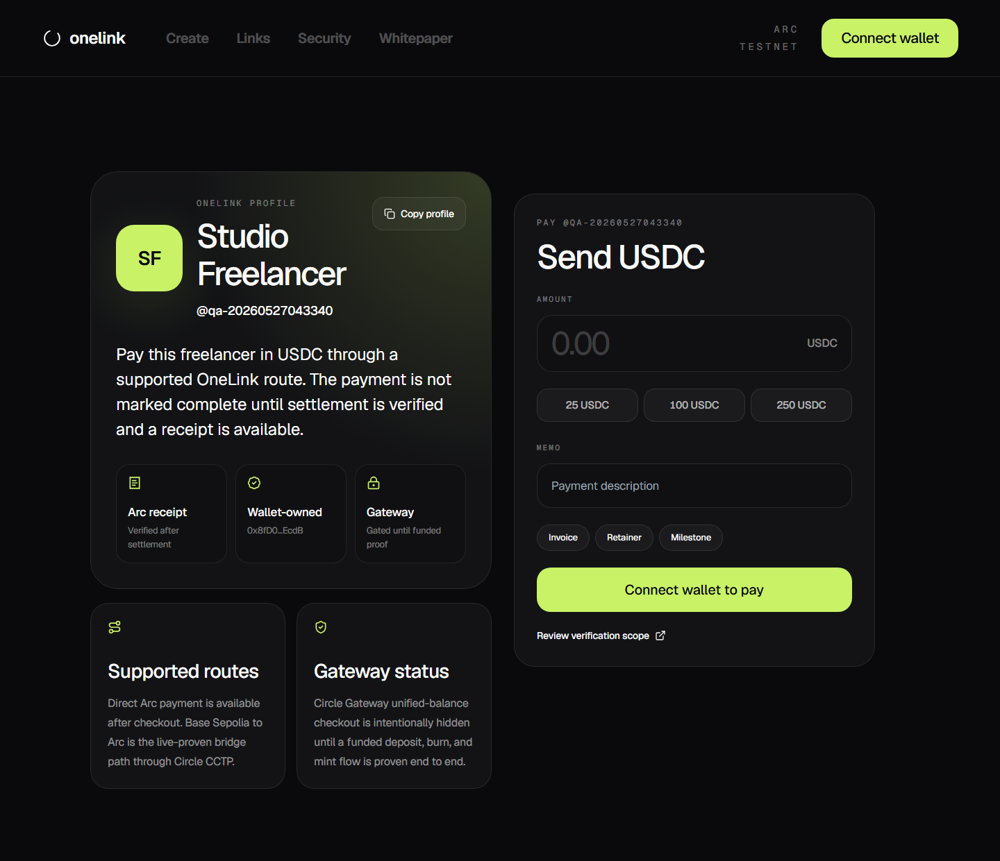
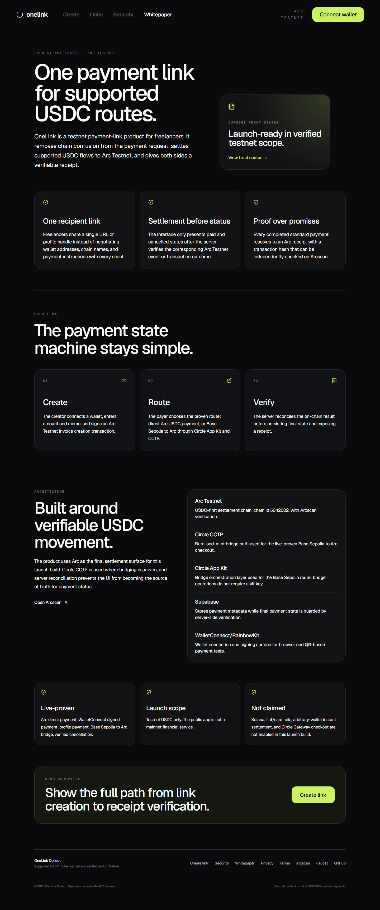

<div align="center">

# OneLink Collect

**One link. Supported USDC routes. Verified on Arc.**

A premium testnet payment-link product for freelancers: create one shareable link, let the payer use a supported USDC route, and finish with a server-verified Arc receipt.

[](https://github.com/Pratiikpy/onelink/actions/workflows/ci.yml)
[](./LICENSE)
[](https://testnet.arcscan.app)

[**Open live app**](https://onelink-mauve-nu.vercel.app) · [**Read whitepaper**](https://onelink-mauve-nu.vercel.app/whitepaper) · [**Launch readiness**](./docs/LAUNCH_READINESS.md)

<br />


</div>

---

## Why OneLink

Freelancers lose time asking clients which wallet, chain, and address format they use. OneLink turns that into a single payment URL or profile handle. The launch build focuses on a verified testnet scope: Arc direct settlement and a Base Sepolia to Arc bridge route powered by Circle CCTP.

OneLink is not claiming mainnet readiness, fiat/card payments, Solana support, or arbitrary-wallet instant settlement. The product language is intentionally limited to what has been proven live.

---

## Product

| Surface | Purpose |
| --- | --- |
| Payment links | Create a specific invoice URL with amount, memo, recipient, expiry, and verified on-chain registration. |
| Profile handles | Publish a permanent `/{handle}` page so a payer can enter amount and memo without asking for a new invoice URL. |
| Checkout | Let the payer review recipient, amount, route, expiry, and testnet scope before signing. |
| Receipts | Expose the verified Arc settlement transaction as the source of truth for completed payments. |
| Trust center | Explain tested routes, limitations, privacy, wallet safety, and reconciliation rules. |
| Whitepaper | Present the product thesis, architecture, Circle/Arc usage, and launch scope in a judge-facing format. |

---

## Repo map

| File | Why it matters |
| --- | --- |
| [`docs/ARCHITECTURE.md`](./docs/ARCHITECTURE.md) | System design, settlement model, trust boundaries, and current product limits. |
| [`docs/LAUNCH_READINESS.md`](./docs/LAUNCH_READINESS.md) | Live deployment evidence, transaction hashes, screenshots, and QA matrix. |
| [`docs/UI_UX_AUDIT.md`](./docs/UI_UX_AUDIT.md) | Final visual audit, responsive checks, and remaining non-UI product limits. |
| [`docs/AI_BUILD_PROCESS.md`](./docs/AI_BUILD_PROCESS.md) | How Codex, MCP tools, local skills, and evidence-first QA were used. |
| [`docs/PRD.md`](./docs/PRD.md) | Product requirements and end-to-end behavior definition. |
| [`supabase/schema.sql`](./supabase/schema.sql) | Database schema, RLS policies, and immutability trigger. |
| [`contracts/src/OneLinkCollect.sol`](./contracts/src/OneLinkCollect.sol) | Arc Testnet settlement contract used by verified receipts. |

---

## Visual walkthrough

<table>
  <tr>
    <td width="50%">
      
      <br />
      <sub><b>Landing</b> - route scope, proof positioning, and primary CTA.</sub>
    </td>
    <td width="50%">
      
      <br />
      <sub><b>Create</b> - amount, memo, recipient, handle, and expiry.</sub>
    </td>
  </tr>
  <tr>
    <td width="50%">
      
      <br />
      <sub><b>Profile</b> - shareable freelancer page with presets, verified route scope, and copyable handle.</sub>
    </td>
    <td width="50%">
      
      <br />
      <sub><b>Checkout</b> - payer review and route selection.</sub>
    </td>
  </tr>
  <tr>
    <td width="50%">
      
      <br />
      <sub><b>Mobile profile</b> - Linktree-style payment page optimized for small screens.</sub>
    </td>
    <td width="50%">
      
      <br />
      <sub><b>Receipt</b> - server-verified settlement proof.</sub>
    </td>
  </tr>
</table>

<p align="center">
  
  <br />
  <sub><b>Whitepaper</b> - product thesis, Arc/Circle architecture, and launch scope in the same visual system.</sub>
</p>

---

## Verified scope

| Area | Status |
| --- | --- |
| Arc direct payment | Live-proven on the public Vercel deployment. |
| Browser-wallet full flow | Live-proven create, approve, pay, refresh, and receipt flow. |
| WalletConnect payment | Live-proven QR pairing and signed Arc settlement through the protocol harness. |
| Base Sepolia to Arc bridge | Live-proven through Circle App Kit and CCTP. |
| Permanent profile payment | Live-proven payer-initiated profile request and settlement. |
| Circle Gateway unified balance | Not enabled in checkout until a funded deposit, burn, and mint flow is proven end to end. |
| Creator cancellation | Live-proven server-verified cancellation after Arc transaction. |
| Visual QA | Production screenshots captured at 390, 768, 1366, 1440, and 1920 pixel widths. |

Detailed evidence is summarized in [docs/LAUNCH_READINESS.md](./docs/LAUNCH_READINESS.md).

---

## Architecture

```text
Creator wallet
  -> signs Arc invoice creation
  -> server verifies PaymentLinkCreated
  -> Supabase stores public payment metadata

Payer wallet
  -> pays directly on Arc, or bridges Base Sepolia USDC to Arc through Circle CCTP
  -> server verifies settlement
  -> dashboard and receipt update only after verified state
```

| Layer | Choice |
| --- | --- |
| App | Next.js 15 App Router, React 19, TypeScript, Tailwind CSS |
| Wallets | wagmi, viem, RainbowKit, WalletConnect/Reown |
| Settlement | Arc Testnet, chain id `5042002` |
| Bridge | Circle App Kit with `@circle-fin/adapter-viem-v2`, CCTP burn/mint route |
| Contracts | Solidity 0.8.28, Foundry tests |
| Storage | Supabase with server-side verification routes |
| Hosting | Vercel production deployment |

---

## Local development

```bash
git clone https://github.com/Pratiikpy/onelink.git
cd onelink
npm install
cp .env.example .env.local
npm run dev
```

The local app can run in demo mode when production environment variables are missing. Demo receipts are visibly marked and do not claim real settlement.

Required production environment variables are documented in [.env.example](./.env.example). Keep private keys, service-role keys, and local `.env*` files out of Git.

---

## Verification commands

```bash
npm run lint
npm run typecheck
npm run build
npm run test:contracts
npm run qa:live:visual
npm run qa:live:browser-wallet
npm run qa:live:walletconnect-payment
npm run qa:live:bridge-payment-ui
npm run qa:live:profile-payment
npm run qa:live:cancel
```

Raw automation artifacts are intentionally not part of the public README. Public proof is summarized in launch readiness and curated screenshots.

---

## Safety boundaries

- Testnet only: do not send mainnet funds.
- Server routes, not the browser, write final `paid` and `cancelled` states.
- Gateway unified-balance checkout remains disabled until separately proven end to end.
- Solana and fiat/card rails are outside the current launch scope.
- Secrets must stay in environment variables or managed deployment settings.

---

## Repository map

```text
app/                 Next.js routes, API handlers, whitepaper, trust pages
components/          Shared UI and product flows
contracts/           OneLinkCollect Solidity contract and tests
lib/                 Arc, payment, storage, and reconciliation utilities
scripts/             Live QA and deployment verification scripts
supabase/            Database schema and migrations
docs/                Launch readiness, UI audit, curated screenshots
```

## License

MIT
